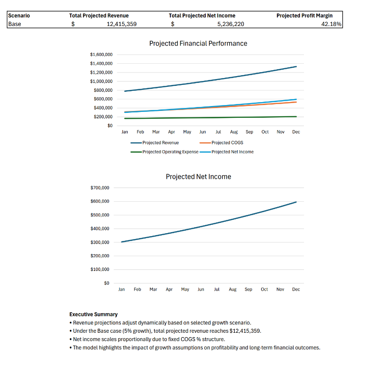

# Revenue Forecast & Scenario Analysis Model

## Project Overview
This project models 12 months of projected revenue and profitability using dynamic growth assumptions. The model incorporates scenario-based forecasting (Conservative, Base, Optimistic) and automatically updates financial projections, KPIs, and dashboard outputs.

The goal of this project was to strengthen financial forecasting, scenario modeling, and structured Excel dashboard development skills relevant to FP&A and financial analytics roles.

---

## Dashboard Preview

---

## Key Features

- 12-month dynamic revenue forecasting
- Scenario-based growth modeling (Conservative / Base / Optimistic)
- XLOOKUP-driven assumption control
- Automated KPI updates
- Net income and profit margin modeling
- Executive-ready financial dashboard

---

## Tools Used

- Microsoft Excel
- Financial forecasting techniques
- Scenario analysis
- XLOOKUP
- Dashboard development
- Financial modeling

---

## Key Insights

- Under the Base scenario (5% growth), projected annual revenue reaches $12.4M.
- Net income scales proportionally due to fixed COGS structure.
- Profit margin remains above 40% under the Base case.
- The model highlights sensitivity of profitability to revenue growth assumptions.

---

## Files Included

- Excel model (.xlsx)
- Executive dashboard export (.pdf)
- Dashboard preview (.png)

---

This project demonstrates forward-looking financial modeling and scenario analysis skills.
